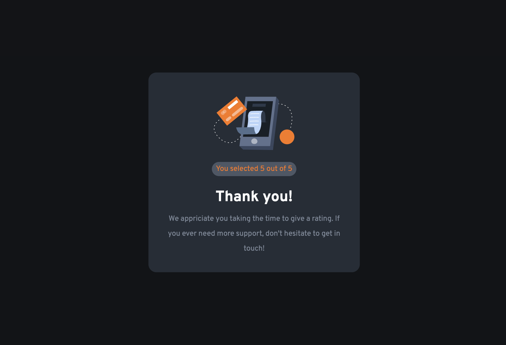

# Frontend Mentor - Interactive Rating Component Solution

This is a solution to the [Interactive rating component challenge on Frontend Mentor](https://www.frontendmentor.io/challenges/interactive-rating-component-koxpeBUmI). I have been using Frontend Mentor challenges to help improving my coding skills by building realistic projects. 

## Table of contents

- [Overview](#overview)
  - [The challenge](#the-challenge)
  - [Screenshot](#screenshot)
  - [Links](#links)
- [My process](#my-process)
  - [Built with](#built-with)
  - [What I learned](#what-i-learned)
  - [Useful resources](#useful-resources)


## Overview

### The Challenge

Users should be able to:

- View the optimal layout for the app depending on their device's screen size
- See hover states for all interactive elements on the page
- Select and submit a number rating
- See the "Thank you" state after submitting a rating

### Screenshots

#### First-State


#### Rating-State


#### Thank-You-State


## My process

### Built with

- Semantic and accessible HTML5 markup
- CSS custom properties
- Flexbox
- Mobile-first workflow

### What I learned

While working through this project, I preferred using HTML/CSS to make my component's states visible or hidden rather than manipulating the DOM one by one with heavy Javascript code. 

I learned doing so is a useful approach to have a lightweight workflow when it comes to extensive applications (i.e. websites)

Here are some useful code snippets from my work:

```html
<div class="second-container hidden">
```
```css
.hidden {
    display: none;
}
```
```js
submitButton.addEventListener("click", () => {
    secondContainer.classList.remove("hidden");
    firstContainer.style.display = "none";
});
```

### Useful resources

- [Example resource 1](https://www.example.com) - This helped me for XYZ reason. I really liked this pattern and will use it going forward.
- [Example resource 2](https://www.example.com) - This is an amazing article which helped me finally understand XYZ. I'd recommend it to anyone still learning this concept.
